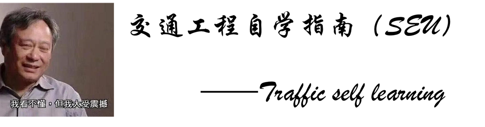

 <!--  -->

**交通工程自学指南**

**网站链接：**[TrafficSelfLearning](https://transfresh.github.io/Traffic-self-learning/)

**如果网站内容对您有所帮助，希望可以点一点Star并推荐给可能需要的人。**

**如果您有更多的想法并愿意将它们分享出来，请加入我们!**

**本项目免费开源，网站资源供大家学习交流使用，转载请标明出处，严谨商用，如果发现网上有人售卖相关内容，请帮忙举报。**

## 简介

回顾一下已经结束的大学生活，交通工程的学习过程中最常遇到的问题大概就是：课程如何学习？大作业有没有参考？哪里能找到考试复习资料？陌生的工具如何开始？面对快速发展的科技我应该做些什么吗？未来又是什么样子的...

这些问题，往往会有学长学姐帮忙解答，这也是学院一直以来的传承。但是，并不是所有人都有足够的渠道来获取所有问题的答案，或者说，尽早获取；同样也并不是所有人都有机会来分享自己的想法和资料；同样的问题在不同时空不断被提出，同样的文字和文件又会被转发很多很多次，这可能来自同一位分享者的分享，也可能是大家相互间的转发。那么，有没有可能存在一个平台，将这些资料全部收集起来，放在一个大家都能看到的地方**自由存放**，让每一项贡献能够被记录从而发挥更大的作用呢？伴随着这个问题，便有了 `TrafficSelfLearning`！

`TrafficSelfLearning` 将提供交通工程课程学习和作业的参考资料，学习和科研常用的工具以及踩过的坑...

当然，`TrafficSelfLearning` 还只是一个刚出生的孩子，那就让我们一起看着他成长吧！

## 使用

请关注网站 [TrafficSelfLearning](https://transfresh.github.io/Traffic-self-learning/)，网站会有志愿者根据投稿情况定期进行维护。

## 投稿

网站中列出了详细的投稿流程，请关注 [我要分享](https://transfresh.github.io/Traffic-self-learning/contribute/)

## 致谢

`TrafficSelfLearning` 项目离不开每一位贡献者无私的付出，也离不开志愿者的管理和维护，感激不尽！
