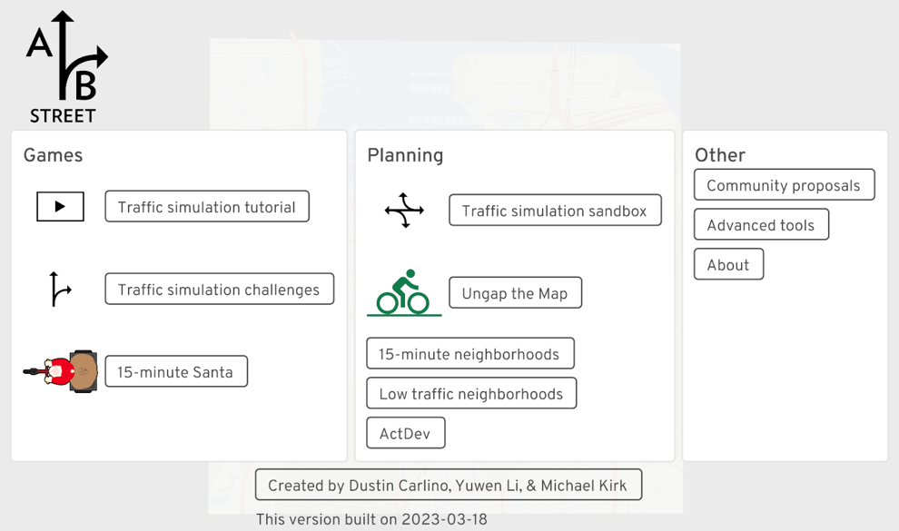
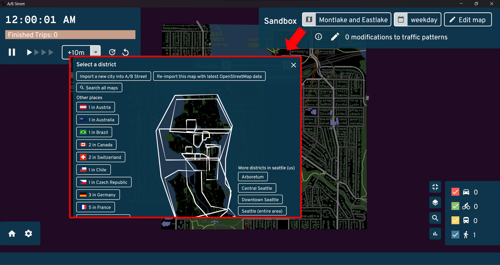
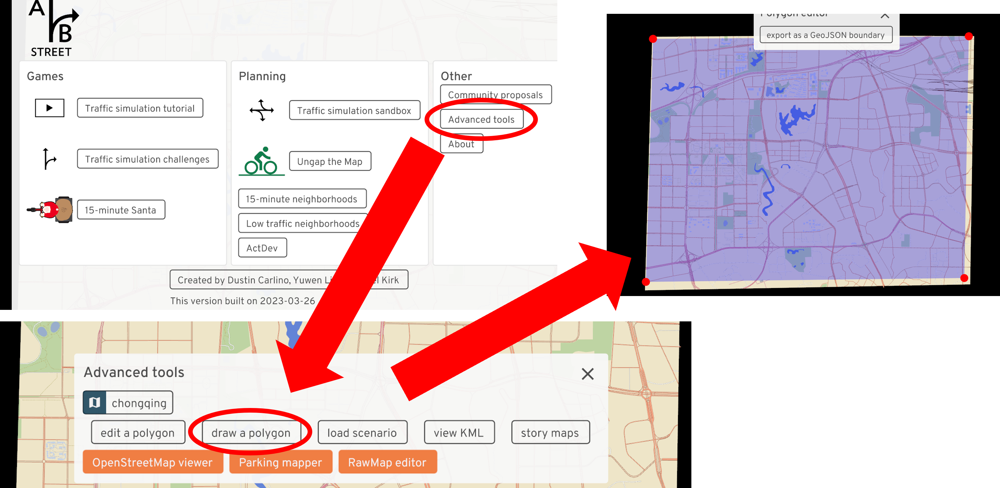
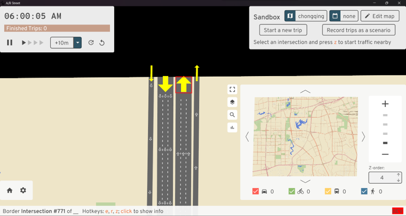

<!--
 * @Author: CQZ
 * @Date: 2024-01-12 21:48:11
 * @Company: SEU
-->
# ABstreet

## 简介

ABstreet是一款开源交通模拟游戏（没错它自称是游戏），探索道路的微小变化如何影响骑自行车的人、公交用户、行人和司机，效果直接上图：


看起来作为一个开源出行链微观交通仿真软件应该很不错，但是它的核心代码是用rust写的，学习的成本一下就上来了，结果就是用的人不多（本篇作者目前没有发现有人在论文中提到这个）。

但是呢，该软件在微观宏观可视化、数据可视化上还蛮好看的，运行起来也很快。因此本篇做个抛砖引玉，介绍一下基本操作，以及如何导入osm地图并运行一个自己的出行场景（本篇作者项目中干过的事儿），至于如何用该软件进行交通仿真研究就留给真正的大佬~~~

## 1. 软件下载和官方文档

ABstreet团队提供了三个版本：网页版、编译版和源码版：

* [网页版](https://play.abstreet.org/0.3.49/abstreet.html)：打开即玩。

* [编译版](https://a-b-street.github.io/docs/user/index.html)：在该网页中寻找适合的版本，Windows版解压后双击play_abstreet.bat即可运行，编译版无法对其内容进行修改。

* [源码版](https://github.com/a-b-street/abstreet)：去官方Github上下载，需要搭配安装了rust才能运行，能够根据需求对其内容进行修改。

这三个版本的操作方式和主要功能都是一样的。这里放个[官方文档](https://a-b-street.github.io/docs/index.html)，关于如何编译源码版和rust安装都有提到，这里简单提一下如何像编译版一样打开源码版：

1. 下载安装rust：根据文档中的需求在[rust官网](https://www.rust-lang.org/tools/install)上下载对应的版本，rust可能会需要安装Visual Studio，根据提示来；

2. 安装检验：打开cmd，输入`cargo`后回车没报错就没问题；

3. 设置环境变量：`RUST_BACKTRACE=1`；

4. （可选）下载官方案例：在源码版文件夹中打开命令框，运行`cargo run --bin updater download`，时间可能会很长；

5. 运行ABstreet：在源码版文件夹中打开命令框，运行`cargo run --bin game --release`，编译时间可能很长。

## 2. 运行

三个版本打开界面都是一样的，这里以编译版为例：



左侧`Games`是游戏本体，中间`Planning`是沙盒仿真和地图设计，右侧`Other`包括了其它根据和制作团队联系方式。

点击左侧的`Traffic simulation tutorial`，跟着它教程走一遍就啥都会了。

NOTE：本文编辑时的版本（2024.01.07）暂时关闭了`Traffic simulation tutorial`，可以下载老版本或者等他们团队更新，听说他们一周一编译。

## 3. 在ABstreet中导入自己的地图并制作自己的场景

软件运行后，打开`Traffic simulation sandbox`，右上角沙盒`Sandbox`菜单栏中左侧第一个键点击后可以换地图，软件自带很多城市的地图。本节的目的是导入自己的地图并制作一个场景，需要采用源码版。



### 1. 准备好你的osm地图

去osm官网下载你需要地区的地图，然后在ABstreet根目录下打开终端，输入

```rust
cargo run --release --bin cli -- oneshot-import 自己的地图的位置\自己的地图.osm
```

最后一行没有说不成功就成功了，成功后会在ABstreet根目录下`data\system\zz\oneshot\maps`里面有`自己的地图.bin`。

### 2. 在ABstreet打开自己的地图

在`Sandbox`地图选择列表最下面就是自己的地图，能看但不能用，因为该软件默认交通从地图的边界生成，但目前自己的地图还没有设置边界，交通无法生成。


### 3. 为自己的地图设置边界

在主菜单`Other`中点击`Advance tools`，在下一个界面中可以选择需要编辑的地图，设置为自己的地图，然后点击`draw a polygon`。

在图上随意点超过三个点就会形成蓝色多边形，多边形内就是所截区域，多边形边界所截道路会在之后变成边界点能够生成从地图外进来的车和人。

点上方按键保存（没错你点完一点反应都没有），然后在ABstreet根目录下会出现
`name goes here.geojson`，可以自己换个名字，比如`自己的地图边界.geojson`。



### 4. 再次导入自己的地图

在ABstreet根目录下打开终端，输入

```rust
cargo run --release --bin cli -- oneshot-import 自己的地图的位置\自己的地图.osm --clip-path=自己的地图边界的位置\自己的地图边界.geojson
```

之后打开地图，其边界就长这个样子：



至此地图部分已经完成了。

### 5. 为自己的地图建立一个场景

一个场景`scenario`，即在这个地图中需要仿真的所有出行者的出行链，每一个出行者可以有多个行程，每个行程包括：

* 行程开始和结束的时间；
* 行程开始和结束的地点经纬度坐标；
* 行程的目的和方式。

这些行程需要写在一个`.json`文件中，语法如下：

```json
{
    "scenario_name": "minimal", // 场景名称
    "people": [
        // 第一个出行者的全部行程
        {
          "trips": [
                // 第一个出行者的第一个行程
                {
                    "departure": 10000, // 旅程开始时间，据当天0点后多少秒再加4个0，例子中是0点后1秒
                    "origin": {
                        "Position": {
                        "longitude": 106.477302, // 起点经度
                        "latitude": 29.579646 // 起点纬度
                        }
                    },
                    "destination": {
                        "Position": {
                        "longitude": 106.608089, // 终点经度
                        "latitude": 29.555661 // 终点纬度
                        }
                    },
                    "mode": "Walk", // 出行方式
                    // 可选方式包括：'Walk', 'Bike', 'Transit', 'Drive'
                    "purpose": "Meal" // 出行目的
                    // 可选目的包括：'Home', 'Work', 'School', 'Escort', 'PersonalBusiness', 'Shopping', 'Meal', 'Social', 'Recreation', 'Medical', 'ParkAndRideTransfer'
                },
                // 第一个出行者的第二个行程
                {
                    "departure": 12000000, // 例子中是0点后1200秒，也就是20分钟
                    "origin": {
                        "Position": {
                        "longitude": 106.477302,
                        "latitude": 29.579646
                        }
                    },
                    "destination": {
                        "Position": {
                        "longitude": 106.608089,
                        "latitude": 29.555661
                        }
                    },
                    "mode": "Bike",
                    "purpose": "Work"
                }
            ]
        },
         // 第二个出行者的全部行程
        {
            "trips": [
                ...
              ]
        }
    ]
}
```

保存为`自己的场景.json`放在ABstreet根目录下，然后在ABstreet根目录下打开终端，输入

```rust
cargo run --release --bin cli -- import-scenario --map=自己的地图bin的位置\自己的地图.bin --input=自己的场景.json --skip-problems
```

### 6. 导入自己的场景

打开自己的地图沙盒`Sandbox`，在沙盒菜单中点击左边第二个按键，在新的界面中选择自己的场景：


OK，这时候就可以看到场景中有车在跑了。

## 4. ABstreet更多的操作

还有更多功能，如多边形取图、与sumo交互、地图修改、颜色修改、结果导出等，等待大佬来补充~~~