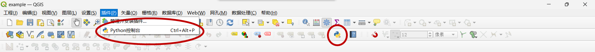
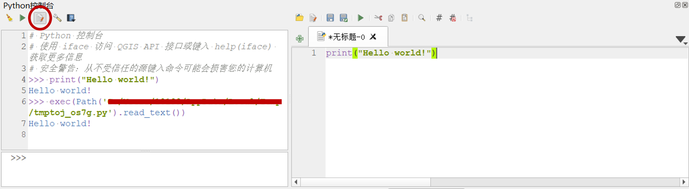
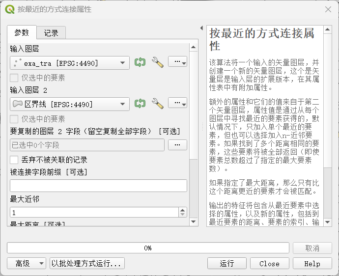
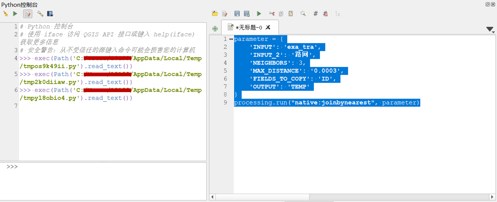

<!--
 * @Author: CQZ
 * @Date: 2023-12-11 09:08:57
 * @Company: SEU
-->
# QGIS

## 为什么会需要GIS

交通工程不会经常去处理地理信息数据，但有时会冷不丁来一下：

* 比如项目上处理一个.shp文件，虽然有许多Python库能对付这些数据，但为什么不用一个友好的可视化窗口来处理呢？

* 比如一些与地图相关的计算上，在成熟的GIS软件上通过“点一点”就能实现；

* 比如做一个漂亮的路网图片给论文加加分；

而大多数GIS软件画画图、做一些入门级操作又不难，不妨了解一下，反正网上教程很多。

主流GIS软件包括一下两个：**ArcGIS** 和 **QGIS**。前者为商业软件，国内用的人居多，专业且精度高，~~但大都用的盗版~~；后者是本文主要吹捧对象。

因为基础教程网上很多，本文作者懂的也不多，也许后面会更新一些常用操作、相关数据处理和画图，本文不涉及这些内容。**本文目前主要介绍如何用Python调用QGIS中的功能，实现批量运行。** 如果以后还更新也会集中在QGIS上。

## 先吹一下QGIS

QGIS是一个开源的基础地理信息系统平台软件，它轻量、好看、免费、开源、有Python API，ArcGIS能做的它都能做，ArcGIS不能做的它也能做。大概有这些优点（主要和AcrGIS比）：

* 轻量化，安装时不会安装一大堆没用的，占空间也小；

* 综合性能较强，程序跑的快，占资源少；

* API调用相对比较方便；

* 图画的好看（个人觉得）。

直接上链接：<https://www.qgis.org/zh-Hans/site/>，直接上图：


## QGIS基础应用

网上很多，以后再说。

## QGIS高级应用

本节主要讲解如何在Python中调用QGIS中的**工具箱**，工具箱内的所有功能都能通过Python调用，并实现批量运行。实际上所有能在QGIS软件中实现的功能都能在Python中实现，除了工具箱内的功能，本节还包括**数据输入、输出**相关功能。

本文内容主要来源于[官方PyQGIS食谱](https://docs.qgis.org/3.28/en/docs/pyqgis_developer_cookbook/)和[官方Python API文档](https://qgis.org/pyqgis/3.28/)，以及作者的个人经历。

### 1. 在QGIS内部调用Python

你可以在界面上方面板中看到一个Python的图标，点开即可启动QGIS内置的Python控制台。若面版中没有Python图标，也可以从最上方插件栏中找到。



界面下方会出现Python控制台，你可以像用Python IDLE一样使用它。


点击控制台上方的“显示编辑器”键，会在旁边打开编辑器并新建一个.py文件，你可以写代码、运行和保存。



[官方PyQGIS食谱](https://docs.qgis.org/3.28/en/docs/pyqgis_developer_cookbook/)中的代码都可以在这个编辑器中调用。接下来介绍如何在这个编辑器内实现工具箱中的功能。

我们将以`工具箱` -> `矢量通用` -> `按最近的方式连接属性`为例，其它工具也可以类比使用。

`按最近的方式连接属性`可以将输入图层1中的元素按最近的距离匹配到输入图层2中的元素，输出为输入图层1的复制，但有匹配到输入图层2的附加属性。就本例来看，我们需要将一系列车辆轨迹点匹配到实际路网上，从而可以得到该车实时所在道路，这个工具就可以在几何上将每一个轨迹点匹配到距离其最近的道路线上，从而一定程度上实现路径匹配。

先来看看一般怎么操作的。当打开任意工具后，会出现配置窗口，下图为`按最近的方式连接属性`的配置窗口，需要根据右侧的要求和个人需求配置左侧各项参数。本工具中必填（没有标`可选`）参数含义为

* `输入图层`：需要被匹配图层，本例为轨迹图层；
* `输入图层2`：目标匹配图层，本例为路网图层；
* `最大近邻`：匹配结果的数量，若为2则将与被匹配元素最近的前两项作为输入，本例为1，即只取最近的匹配结果。

点击`运行`后，工程中多了一个**被连接图层**，该图层即为所需要的输出。



接下来看看如何在Python控制台中实现相同的功能。直接上代码：

```python
parameter = {
    'INPUT': 'exa_tra',
    'INPUT_2': '路网',
    'NEIGHBORS': 1,
    'OUTPUT': 'TEMP'
}
processing.run("native:joinbynearest", parameter)
```

字典`parameter`即上图中所配置的各项参数，其中的键即该工具所需输入参数的名称，与上图中的选项一一对应，而值即需要配置赋予的值。各项含义如下：

* `INPUT`：即`输入图层`所需的图层名；
* `INPUT_2`：即`输入图层2`所需的图层名；
* `NEIGHBORS`：即`最大近邻`所取的值；
* `OUTPUT`：即输出文件的名称，后面解释为什么要配置。

执行`processing.run()`函数来运行工具，第一个参数为工具名称，第二个参数为工具的输入参数配置。以上代码为工具箱调用代码，参数可不配置`可选`项，不同工具的名称和输入参数不同，需要对应地参阅官方文档，文档中都有列出。

在Python控制器运行后，会在控制器中出现下图的输出，但并没有像一般操作一样生成一个新的图层（运行的3次）：



这是由于QGIS的奇妙机制，其实图层输出到了工程文件夹中。打开`.qgz`所在文件夹，会发现多了一个`TEMP.gpkg`文件，该文件即输出，把它导入QGIS中即可。

能不能在代码中顺便把这个导入完成掉呢？当然能，需要一些QGIS基础操作。在上述代码后加入一下代码：

```python
vlayer = QgsVectorLayer("TEMP.gpkg", "TEMP", "ogr")
QgsProject.instance().addMapLayer(vlayer)
```

变量`vlayer`指向需要导入的图层，第一个参数为文件名称，第二个参数为导入后图层名称，第三个参数为该图层的坐标系。第二行代码将图层导入到当前工程中。

完整代码如下：

```python
parameter = {
    'INPUT': 'exa_tra',
    'INPUT_2': '路网',
    'NEIGHBORS': 1,
    'OUTPUT': 'TEMP'
}
processing.run("native:joinbynearest", parameter)

vlayer = QgsVectorLayer("TEMP.gpkg", "TEMP", "ogr")
QgsProject.instance().addMapLayer(vlayer)
```

在Python控制器中运行以上代码，即可得到与一般操作中相同的结果，即图层`TEMP`。

### 2. 采用Python API在外部实现QGIS功能

上述操作都需要打开QGIS进行，那能不能避免打开QGIS，仅需运行一个`.py`文件来实现上述功能呢？当然可以，但显然不能直接复制上述代码直接运行，我替你试了，报错，无法识别其中的函数。

这是因为QGIS中的Python控制台调用的是QGIS内部的Python，里面已经导入了其所包含的所有库，能够直接运行上述代码。

难道需要在自己的Python中安装对应的库吗？我帮你看了看QGIS中Python的架构，太复杂了，倒不如把QGIS中的Python“整出来”变成自己的。也就是说，在自己的编译器上选择QGIS中Python解释器来运行你的`.py`文件，从而在外部实现上述功能。

接下来你需要的就是配置你电脑的环境，将需要的部件写入环境变量中。（不会配置环境变量？百度去）步骤如下：

1. 在变量`Path`中写入：

```txt
你的QGIS所在地\QGIS\apps\Python39
你的QGIS所在地\QGIS\bin
你的QGIS所在地\QGIS\apps\qgis-ltr\bin
```

2. 在变量`PYTHONPATH`中写入：

```txt
你的QGIS所在地\QGIS\apps\qgis-ltr\python
你的QGIS所在地\QGIS\apps\qgis-ltr\bin
你的QGIS所在地\QGIS\apps\qgis-ltr\python\plugins
你的QGIS所在地\QGIS\apps\qgis-ltr\python\qgis
```

**注意**：`你的QGIS所在地\QGIS\apps\qgis-ltr\python\plugins`一定要在`你的QGIS所在地\QGIS\apps\qgis-ltr\python\qgis`的上面，因为这两个文件中都有`processing`函数，我们需要前者中的。

我也不知道怎样测试是否配置成功，如果你可以从你的编译器中找到QGIS中的Python3.9.5（本文所用的QGIS版本为3.2.8），那应该成功了。截至本文的更新日期，上述配置亲测有效。

接下来通过在QGIS外部写`.py`文件实现上一节的功能。新建`.py`文件后，需要导入一下库：

```python
from qgis.core import *
from qgis.gui import *
from qgis.core import *

import processing
from processing.core.Processing import Processing
```

`qgis`相关库是外部`.py`文件调用QGIS的基础，而`processing`即工具箱的API。首先需要在Python中打开你的工程文件`.qgz`:

```python
qgs = QgsApplication([], False)
qgs.initQgis()
project = QgsProject.instance()
p = project.read('你的工程所在地址/你的工程文件名.qgz')
print(project.fileName() + "'s applicability is", p)
```

前三行进行初始化，第四行读取工程文件，第五行检验是否导入成功。当输出`你的工程所在地址/你的工程文件名.qgz's applicability is True`时，说明导入成功。

```python
Processing.initialize()
parameter = {
    'INPUT': 'exa_tra',
    'INPUT_2': '路网',
    'NEIGHBORS': 1,
    'OUTPUT': 'TEMP'
}
processing.run("native:joinbynearest", parameter)
vlayer = QgsVectorLayer("TEMP.gpkg", "TEMP", "ogr")
QgsProject.instance().addMapLayer(vlayer)
```

第一行为工具箱的初始化，后面就可以把上一节的代码复制过来就行。完整代码如下：

```python
from qgis.core import *
from qgis.gui import *
from qgis.core import *

import processing
from processing.core.Processing import Processing

qgs = QgsApplication([], False)
qgs.initQgis()
project = QgsProject.instance()
p = project.read('你的工程所在地址/你的工程文件名.qgz')
print(project.fileName() + "'s applicability is", p)

Processing.initialize()
parameter = {
    'INPUT': 'exa_tra',
    'INPUT_2': '路网',
    'NEIGHBORS': 1,
    'OUTPUT': 'TEMP'
}
processing.run("native:joinbynearest", parameter)
vlayer = QgsVectorLayer("TEMP.gpkg", "TEMP", "ogr")
QgsProject.instance().addMapLayer(vlayer)

qgs.exitQgis()
```

最后一行退出运行中的QGIS。

如果你有多个轨迹数据需要如上操作，并需要得到导出数据，如何实现呢？首先是导入数据，QGIS能导入的数据类型很多，我们以`.csv`文件为例。假设`example_tra.csv`包含一组轨迹数据，包括点的ID、经纬度等数据，需要导入工程中生成一个图层再进行如上操作。如何在QGIS中进行导入这里不再赘述，下面主要讲解如何在上述`.py`文件中导入。

导入数据应当在打开工程文件后进行，加入一下代码：

```python
uri = 'file:///' + '你的.csv文件地址' + '?delimiter=%s&xField=%s&yField=%s' % (',', 'x', 'y')
vlayer = QgsVectorLayer(uri, '导入后的图层名', 'delimitedtext')
if vlayer.isValid():
    pass
else:
    raise RuntimeError('Fail to load the data.')
QgsProject.instance().addMapLayer(vlayer)
```

第一行设置导入文件和方式，第一个映射变量为分离字符，后两个为在导入文件中经纬度所在列的名称；第二行设置导入后的图层名称并进行读取；第三行采用`vlayer.isValid()`检验是否读取成功；最后一行进行导入。

接下来是输出。如何在QGIS中进行输出这里不再赘述，下面主要讲解如何在上述`.py`文件中输出。

本例采用工具箱中的输出工具，将匹配完成的图层输出为`.xlsx`文件。类比上一节，这里直接上代码：

```python
parameter = {
        'LAYERS': 'TEMP',
        'OUTPUT': '输出文件地址/输出文件名.xlsx'
    }
processing.run("native:exporttospreadsheet", parameter)
QgsProject.instance().removeMapLayer(vlayer)
```

最后一行将我们新导入的图层删除，这样好后面的批量处理，工程中不会多出很多图层。

完整代码如下：

```python
from qgis.core import *
from qgis.gui import *
from qgis.core import *

import processing
from processing.core.Processing import Processing

qgs = QgsApplication([], False)
qgs.initQgis()
project = QgsProject.instance()
p = project.read('你的工程所在地址/你的工程文件名.qgz')
print(project.fileName() + "'s applicability is", p)

uri = 'file:///' + '你的.csv文件地址' + '?delimiter=%s&xField=%s&yField=%s' % (',', 'x', 'y')
vlayer = QgsVectorLayer(uri, '导入后的图层名', 'delimitedtext')
if vlayer.isValid():
    pass
else:
    raise RuntimeError('Fail to load the data.')
QgsProject.instance().addMapLayer(vlayer)

Processing.initialize()
parameter = {
    'INPUT': 'exa_tra',
    'INPUT_2': '路网',
    'NEIGHBORS': 1,
    'OUTPUT': 'TEMP'
}
processing.run("native:joinbynearest", parameter)
vlayer = QgsVectorLayer("TEMP.gpkg", "TEMP", "ogr")
QgsProject.instance().addMapLayer(vlayer)

parameter = {
        'LAYERS': 'TEMP',
        'OUTPUT': '输出文件地址/输出文件名.xlsx'
    }
processing.run("native:exporttospreadsheet", parameter)
QgsProject.instance().removeMapLayer(vlayer)

qgs.exitQgis()
```

现在，你可以通过修改输入、输出的文件名来对多个文件运行。

### 3. 在其它版本Python中调用上述代码

以上代码只能在QGIS内部的Python环境下运行。假设在运行上述代码的前后，还有前置或后置任务需要在你的环境下运行，那如何实现呢？

总归知道如何在cmd命令行中运行Python吧？不会我教你，在上述`.py`所在文件夹下打开命令提示符，运行以下代码：

```cmd
你的QGIS地址/QGIS/apps/Python39/python 上述代码文件名.py
```

现在问题转换为：如何在另一个`.py`中运行命令提示符？为了能在命令提示符中自定义参数，我们采用`argparse`模块修改上一节代码，完整代码如下：

```python
from qgis.core import *
from qgis.gui import *
from qgis.core import *

import processing
from processing.core.Processing import Processing

import argparse
dir = os.getcwd()
parser = argparse.ArgumentParser()
parser.add_argument('--file', type=str, default='你要导入的文件名')

def main(file):
    qgs = QgsApplication([], False)
    qgs.initQgis()
    project = QgsProject.instance()
    p = project.read('你的工程所在地址/你的工程文件名.qgz')
    print(project.fileName() + "'s applicability is", p)

    uri = 'file:///' + '你的.csv文件地址/' + file + '.csv?delimiter=%s&xField=%s&yField=%s' % (',', 'x', 'y')
    vlayer = QgsVectorLayer(uri, file, 'delimitedtext')
    if vlayer.isValid():
        pass
    else:
        raise RuntimeError('Fail to load the data.')
    QgsProject.instance().addMapLayer(vlayer)

    Processing.initialize()
    parameter = {
        'INPUT': file,
        'INPUT_2': '路网',
        'NEIGHBORS': 1,
        'OUTPUT': 'TEMP'
    }
    processing.run("native:joinbynearest", parameter)
    vlayer = QgsVectorLayer("TEMP.gpkg", "TEMP", "ogr")
    QgsProject.instance().addMapLayer(vlayer)

    parameter = {
            'LAYERS': 'TEMP',
            'OUTPUT': '输出文件地址/' + file + '.xlsx'
        }
    processing.run("native:exporttospreadsheet", parameter)
    QgsProject.instance().removeMapLayer(vlayer)

    qgs.exitQgis()

main(file)
```

在另一个需要实现上述代码的`.py`文件中，写入以下代码：

```python
import os

f = os.popen("你的QGIS地址/QGIS/apps/Python39/python 上述代码文件名.py --file 你要导入的文件名")
print(f.read())
```

运行以上代码，即可实现在自己的Python环境上调用QGIS工具箱。
