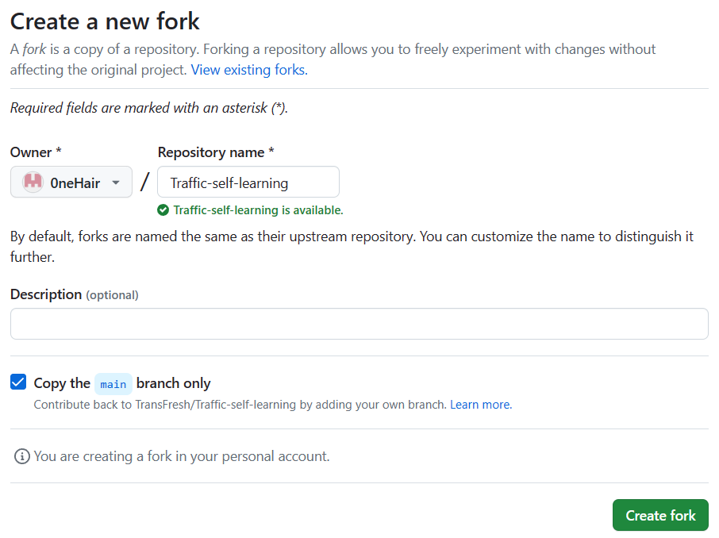
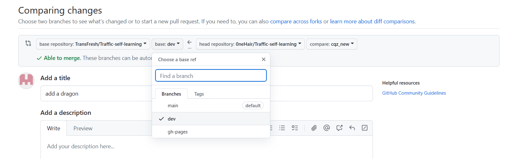

# 如何投稿

## 投稿要求

你可以分享任何与交通工程相关甚至不相关的内容。包括但不限于: 对课程的见解，对工具的介绍，对未来发展出路的介绍 (如果你是“过来人”的话) 等等。请你在分享时尽量做到真实、客观，不要大张旗鼓地夹带私货。

## 投稿方式

我们提供如下两种投稿方式: 通过 GitHub ，通过邮件。你可以选择任意一种方式进行投稿，如果你在投稿的同时还希望上传资源文件，请使用[方式2](#方式2-通过邮件投稿)将资源文件以邮件形式发送给我们，当你的 pull request 被成功合并、资源文件审核完成后，我们会为你提供的资源文件添加链接。

Note: 本文档只提供对投稿方式的介绍，具体的要求如: 稿件应该归属哪个文件夹或者插入到哪个位置等，请参考对应模块文件夹下的 `README.md` 文件。

### 方式1 通过 GitHub 投稿 (推荐)

1. 复刻仓库: 单击 `Fork` 按钮，在你的账号下创建 [`Traffic-self-learning`](https://github.com/TransFresh/Traffic-self-learning) 仓库的副本

    

    

2. 将复刻的仓库克隆到本地

    ```bash
    git clone https://github.com/YOUR USER NAME/Traffic-self-learning
    ```

3. 为原始仓库 (即本站点仓库) 创建远程关联

    ```bash
    git remote add upstream https://github.com/TransFresh/Traffic-self-learning.git
    ```

    使用 `-v` 命令检查当前仓库已配置的远程仓库，得到如下输出

    ```text
    origin  https://github.com/YOUR USER NAME/Traffic-self-learning.git  (fetch)
    origin  https://github.com/YOUR USER NAME/Traffic-self-learning.git  (push)
    upstream  https://github.com/TransFresh/Traffic-self-learning.git  (fetch)
    upstream  https://github.com/TransFresh/Traffic-self-learning.git  (push)
    ```

4. 在本地仓库创建一个新的分支

    ```bash
    git checkout -b YOUR BRANCH NAME
    ```

5. 从 upstream 分支上拉取最新代码

    ```bash
    git fetch upstream
    git merge upstream/origin
    ```

6. 将最新代码同步至你的远程仓库 (复刻的仓库)

    如果当前已经是最新版本，则不需要进行此步骤

    ```bash
    git push origin origin
    ```

7. 添加你想要投稿的内容

8. 将投稿内容推送到你的远程仓库

    ```bash
    git add YOUR NEW CONTENT
    git commit -m "Your description to the new content"
    git push -u origin YOUR BRANCH NAME
    ```

9. 当投稿内容被成功推送到远程仓库后，在仓库主页点击 `Compare & pull request` 按钮进入 `pull request` 界面，**选择我们仓库的dev分支**
    
    

### 方式2 通过邮件投稿

直接将你的稿件和资料等通过邮件的形式发送给我们，邮件地址为: <seu_tcctt@163.com>

为了防止邮件中遗漏重要的信息，我们推荐你参考这份[模板](./ContributeContent/template.md)

我们建议你使用 Markdown 的格式投稿 (排版格式参考: [Markdown 排版要求](./ContributeContent/markdown_format.md))，但你也可以选择其他易于查看、编辑的文件格式进行投稿。为了保证文件格式的一致性，我们可能会对你的稿件进行修改 (主要是格式上的调整) ，并将修改后的稿件重新发送给你，如果你同意我们的修改，则你的内容在不久后就会被添加到网页中。
