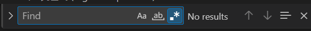

# 一点点好东西

这里是对[知识](./knowledge.md)、[工具](./tools.md)甚至是[未来](./future.md)板块相关内容的补充，比如: 易错的或者难以辨析的概念，令人困惑但是时不时又会在某处用到的知识，抑或是踩过的坑 (也许这个坑很小，却足以绊住前进的脚步)。总之，这里是一个内容充分自由的板块，没准翻着翻着就遇到宝藏了呢？

## 正则表达式 (regular expression)

不知道你在使用IDE的搜索功能时是否遇到过下图所示的按钮，`Use Regular Expression (Alt+R)`:



或者在使用 `bash` 时遇到过 `grep` 命令，比如在下面这个检索僵尸进程的命令中:

```bash
ps -A -ostat, ppid, pid, cmd | grep -e "^[Zz]"
```

也许你会感到奇怪，"^[Zz]" 是个什么东西，又或许你早就知道了这个`正则表达式`的含义，但是在它应当发挥作用的时候却觉得“用不起来”，那么下面两个网站可能会帮到你。

### [Road 2 Coding 正则表达式](https://www.r2coding.com/#/?id=正则表达式)

该站点提供了:

- 正则表达式速查表
- 正则表达式可视化工具
- 常用正则表达式示例

可以帮助你无痛学习正则表达式。

### [regex101](https://regex101.com/)

该站点提供了一个可以快速搭建、测试、调试正则表达式的平台，对于你输入的正则表达式和测试字符串，能够给出正则表达式的解释，以及测试字符串的匹配结果。该网站还提供了将输入的正则表达式转为代码的工具，支持 `Python` ，`Java` ，`Golang` 等多种语言。

## 镜像

正在施工中...
